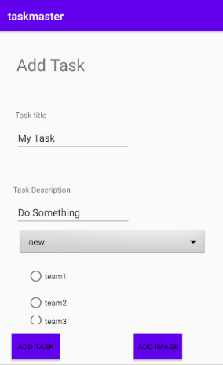
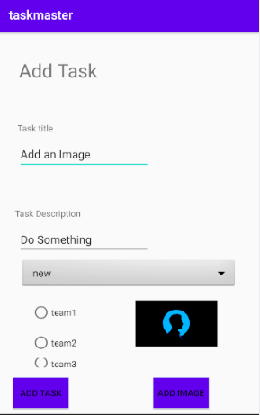
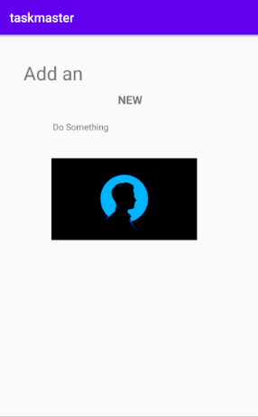

# taskmaster

# Lab: 37 - S3
- Is to allow users to upload files related to tasks, like screenshots or log files.

## Feature Tasks

### Uploads
- On the **Add a Task** activity, allow users to optionally select a file to attach to that task.
- If a user attaches a file to a task, that file should be uploaded to **S3**, and associated with that task.

### Displaying Files
- On the Task **detail activity**.
- If there is a file that is an image associated with a particular Task, that image should be displayed within that activity.

## Screen Shots

- *Before Adding a task*  
 

- *After Adding a task*  
 

- *Detail Page*  
 

## Previous labs documentation

| Lab no.       | Link to the documentation  |         
| ------------|-----------------------------|
|Lab: 26|[Beginning TaskMaster](labs/LAB26.md)|
|Lab: 27|[Data in TaskMaster](labs/LAB27.md)|
|Lab: 28|[RecyclerView](labs/LAB28.md)|
|Lab: 29|[Room](labs/LAB29.md)|
|Lab: 31|[Espresso and Polish](labs/LAB31.md)|
|Lab: 32|[Amplify and DynamoDB](labs/LAB32.md)|
|Lab: 33|[Related Data](labs/LAB33.md)|
|Lab: 34|[Publishing to the Play Store](labs/LAB34.md)|
|Lab: 36|[Cognito](labs/LAB36.md)|

