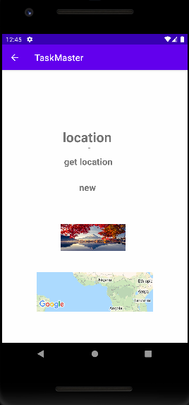

# Lab: 42 - Location

- Is to add the user’s location to a task automatically when that task is created.

## Feature Tasks

### Location

- When the user adds a task, their location should be retrieved and included as part of the saved Task.

### Displaying Location

- On the Task Detail activity, the location of a Task should be displayed if it exists.

## Screen Shots

